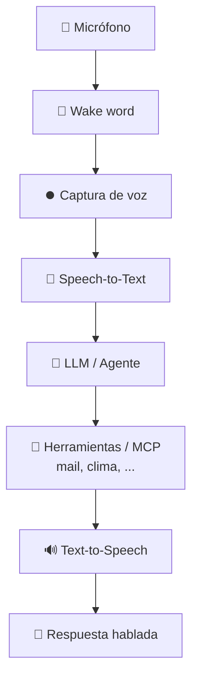

# 🎙️ Voice Assistant

Asistente de voz en Python que se activa con una palabra o frase personalizada
(por ejemplo, *"Hola Deby"*) y resuelve pedidos del usuario mediante un
**LLM / Agente** con acceso a herramientas y servidores **MCP** (correo, clima, etc.).

## 🧩 Etapas de un asistente de voz



1. 🔑 **Wake word** — el asistente escucha de forma continua y se activa al
   detectar la palabra clave (*"Deby"*).
2. ⏺️ **Captura de voz** — una vez activado, graba el comando del usuario.
3. 📝 **Speech-to-Text** — transcribe el audio a texto.
4. 🤖 **LLM / Agente** — interpreta el pedido y decide qué herramientas o
   servidores MCP usar para resolverlo.
5. 🔧 **Herramientas / MCP** — ejecutan la acción (correo, clima, etc.).
6. 🔊 **Text-to-Speech** — convierte la respuesta en voz.

## 📋 Requisitos

- 🐍 Python 3.11 — **requerido**. `openwakeword` no es compatible con
  versiones superiores (3.12+).
- 📦 [uv](https://docs.astral.sh/uv/) para gestión de dependencias

## ⚙️ Instalación

```bash
uv sync
```

## ▶️ Uso

```bash
python -m voice_assistant
```

## 🔧 Configuración

Las variables de entorno se cargan desde un archivo `.env`:

```bash
cp .env.example .env
```

| Variable    | Descripción                                        | Valor por defecto |
|-------------|----------------------------------------------------|-------------------|
| `LOG_LEVEL` | Nivel de logging (`DEBUG`, `INFO`, `WARNING`, ...) | `DEBUG`           |

## 🧪 Tests

```bash
# Pruebas unitarias
pytest

# Pruebas de integración (requieren micrófono y audio de ejemplo)
pytest -m integration
```
